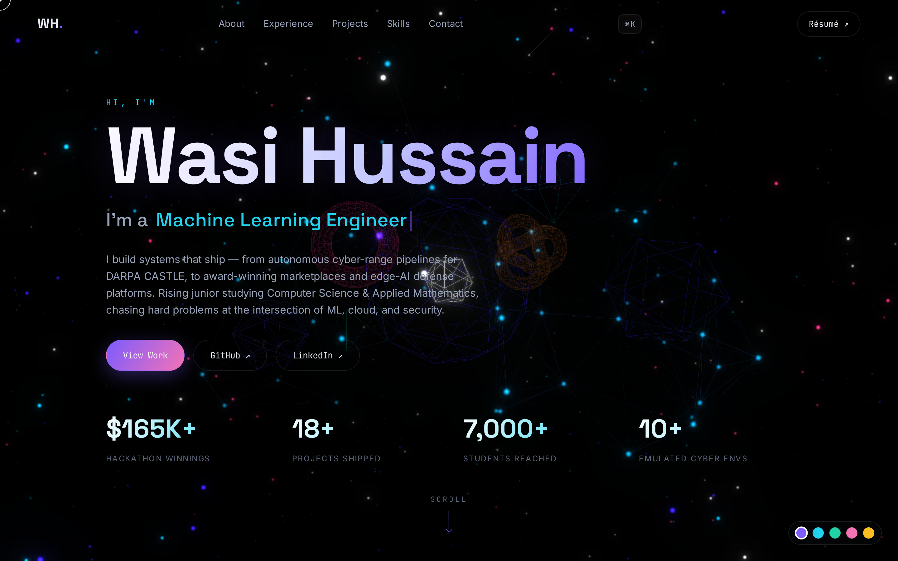

# Wasi Hussain — 3D Portfolio

A flashy, interactive, single-page portfolio built with **Three.js** and vanilla
JavaScript — **no framework, no build step**. Open `index.html` and it runs.



## Highlights

- **Cinematic 3D hero** — a live particle starfield rendered with real
  **UnrealBloom post-processing**, a drifting **constellation network**,
  floating wireframe polyhedra (incl. a torus knot), occasional **shooting
  stars**, and a glowing core that **pulses when you click**. Reacts to the
  mouse and to scroll (Three.js / WebGL + EffectComposer + FXAA).
- **Draggable 3D skills sphere** — every skill as a gradient text sprite on a
  rotating globe you can grab and spin.
- **Project detail modals** — click any card for the full story: impact
  metrics, full stack, category tags, and a direct link. Keyboard-accessible,
  focus-managed, `Esc` to close.
- **Command palette (⌘K / Ctrl-K, or `/`)** — fuzzy-jump to any section,
  project, or link, fully keyboard-driven (↑ ↓ ↵ esc). Click the nav `⌘K` chip
  too.
- **Live accent theming** — a floating swatch switcher recolours the entire
  site *and the 3D scene* in real time (violet / cyan / emerald / rose / amber),
  persisted to `localStorage`.
- **3D tilt project cards** — every real project I've shipped, with award
  badges, live metrics, a mouse-tracked parallax tilt and a spotlight sheen.
  Filter by category with live counts (Award-Winning / AI-ML / Cloud / Security
  / Web / Tools). An **awards marquee** ribbons the headline wins.
- **Animated everything** — typed role rotator, count-up stat counters,
  scroll-reveal sections, active-section nav highlight, custom cursor, magnetic
  buttons, scroll-progress bar, glassmorphism.
- **Hidden easter egg** — the Konami code (`↑↑↓↓←→←→ B A`) triggers confetti. 🪓
- **SEO + social ready** — JSON-LD `Person` structured data, Open Graph +
  Twitter cards with a generated `og.png`, `sitemap.xml`, `robots.txt`,
  canonical URL.
- **Fully responsive** and **accessible** — honors `prefers-reduced-motion`,
  keyboard-navigable, semantic HTML + ARIA, graceful mobile menu.
- **Degrades gracefully** — if WebGL, the Three.js CDN, or even just the
  post-processing addons are unavailable, each layer is skipped independently
  and the content site still works perfectly.

## Keyboard shortcuts

| Key | Action |
| --- | --- |
| `⌘K` / `Ctrl-K` / `/` | Open the command palette |
| `↑` `↓` | Move through palette results |
| `↵` | Open the highlighted result |
| `Esc` | Close palette / project modal |
| `↑↑↓↓←→←→ B A` | 🎉 |

## Structure

```
portfolio/
├── index.html            # markup + import map for Three.js
├── css/style.css         # all styling (dark neon-glass system)
├── js/
│   ├── data.js           # single source of truth: profile, projects, etc.
│   ├── main.js           # renders content + modal, palette, theming, konami
│   └── scene.js          # Three.js hero (bloom/constellation) + skills sphere
├── assets/resume.pdf     # downloadable résumé
├── og.png                # generated 1200×630 social-share image
├── robots.txt · sitemap.xml
├── .github/workflows/deploy.yml   # auto-deploy to GitHub Pages
├── tests/smoke.spec.js   # Playwright end-to-end smoke suite
├── playwright.config.js
└── package.json
```

**Want to change content?** Everything on the page is driven by `js/data.js`.
Edit the projects / experience / skills there — no HTML surgery needed.

## Run locally

Any static server works. Two easy options:

```bash
# Option A — npm script (Python's built-in server)
npm run serve         # → http://localhost:8080

# Option B — anything static
npx serve .           # or:  python3 -m http.server 8080
```

Then open <http://localhost:8080>.

## Tests

End-to-end smoke tests drive the real page in a real browser (Playwright):
they assert every section renders from data, the project filter works, the 3D
canvases boot with **no console errors**, and the personal links + résumé
resolve.

```bash
npm install
npm run test:install   # one-time: downloads Chromium
npm test               # runs the suite (auto-starts the static server)
```

Current status: **26/26 passing** across desktop + mobile viewports — covering
the hero, filters, project modal, command palette, awards ribbon, accent
theming + persistence, SEO metadata, 3D canvases, and the résumé.

## Deploy (GitHub Pages)

A GitHub Actions workflow (`.github/workflows/deploy.yml`) ships this to Pages
on every push to `main` — no build step. If this folder is the repo root:

```bash
git init && git add -A && git commit -m "Portfolio"
git branch -M main
git remote add origin git@github.com:wasihussain914/wasihussain914.github.io.git
git push -u origin main
# then: repo Settings → Pages → Source: GitHub Actions
```

Live in ~2 minutes at `https://wasihussain914.github.io/`. Or drop the folder
into Netlify / Vercel / Cloudflare Pages — no build command, publish directory
= `portfolio/`.

## Tech

Three.js 0.160 + EffectComposer / UnrealBloom / FXAA (via jsDelivr import map) ·
vanilla ES modules · Space Grotesk / Inter / JetBrains Mono · Playwright for
tests · GitHub Actions for deploy.

---

Built by **Syed W. (Wasi) Hussain** — [GitHub](https://github.com/wasihussain914)
· [LinkedIn](https://www.linkedin.com/in/wasihussain914)
